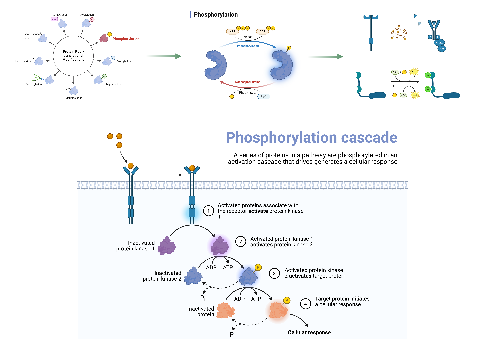
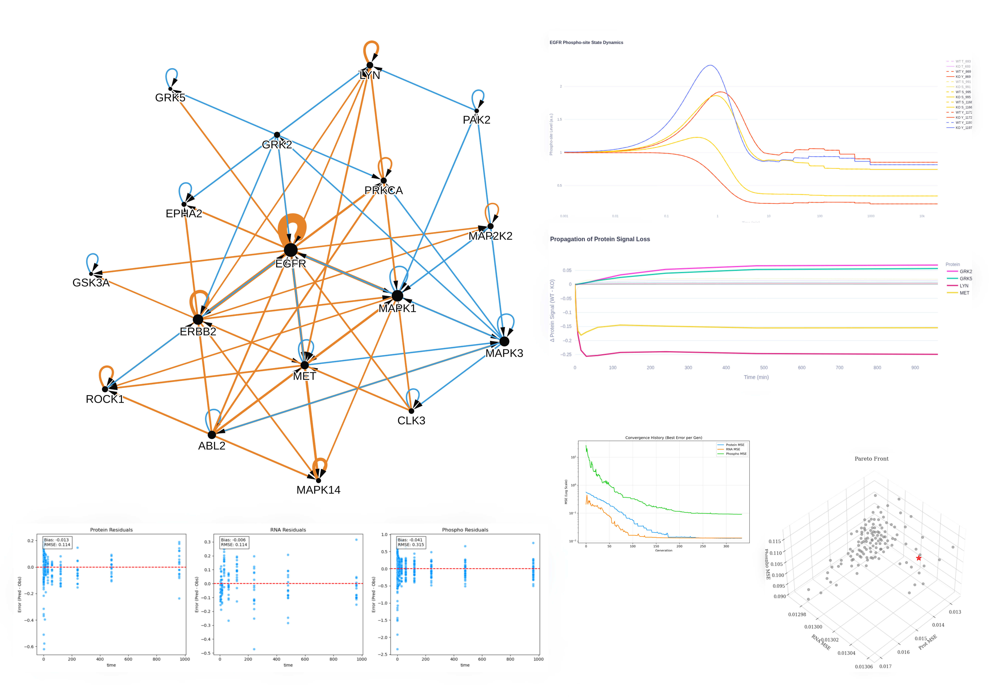

<div align="center">
  

  [](https://doi.org/10.5281/zenodo.15351017) 
  
  

</div> 

--- 

> 💡 **PhosKinTime** is an ODE-based modeling package for analyzing phosphorylation dynamics over time. It integrates
parameter estimation, sensitivity analysis, steady-state computation, and visualization tools to help researchers
explore kinase-substrate interactions in a temporal context. 

---
## [Documentation](https://bibymaths.github.io/phoskintime/)

---


<details>
<summary><strong>🚧 Work in Progress: Web Interface & Package Finalization</strong> (Click to expand)</summary>
<br>

I am actively working to make these powerful network dynamics tools as accessible and adaptable as possible for all researchers.

Currently, I am focusing on two major updates:

1. **A No-Code Web Interface:** I am building a frontend that will allow you to upload data, run parameter estimations, and generate interactive visualizations (PCA, t-SNE, network topology) directly from your browser—no command line required.
2. **Finalizing the Python Package:** The core ODE modeling and optimization logic is built. I am currently finalizing the documentation for experimental data preparation and refining the command-line entry points to make the package easily adaptable to your specific datasets.

*Note: Whether you prefer running Python scripts or using a graphical web app, be sure to **"Watch"** this repository (click the star/watch button at the top right) to be notified as soon as the complete documentation and frontend are released!*

</details>

---

## The Problem: Phosphorylation Cascades

In cellular signaling pathways, a series of proteins are phosphorylated in an activation cascade that drives cellular responses. Understanding these post-translational modifications is critical.



*Figure 1: Overview of protein post-translational modifications and the phosphorylation cascade mechanism.*

---

## Features & Analysis
PhosKinTime allows you to visualize network topology, track protein signal loss/propagation over time, and evaluate model convergence. 



*Figure 2: PhosKinTime outputs including network graphing, kinetic time-series modeling, and residual analysis.* 

--- 

<details>
<summary>Acknowledgements (Click to expand) </summary>

This project originated as part of my master's thesis work at Theoretical Biophysics group (
now, [Klipp-Linding Lab](https://rumo.biologie.hu-berlin.de/tbp/index.php/en/)), Humboldt Universität zu Berlin.

- **Conceptual framework and mathematical modeling** were developed under the supervision of **[Prof. Dr. Dr. H.C. Edda Klipp](https://rumo.biologie.hu-berlin.de/tbp/index.php/en/people/51-people/head/52-klipp)**.
- **Experimental datasets** were provided by the **[(Retd. Prof.) Dr. Rune Linding](https://rumo.biologie.hu-berlin.de/tbp/index.php/en/people/51-people/head/278-rune-linding)**.
- The subpackage `tfopt` is an optimized and efficient derivative
  of [original work](https://github.com/Normann-BPh/Transcription-Optimization) by my colleague **[Julius Normann](https://github.com/Normann-BPh)**, adapted with permission.

I am especially grateful
to [Ivo Maintz](https://rumo.biologie.hu-berlin.de/tbp/index.php/en/people/54-people/6-staff/60-maintz) for his generous
technical support, enabling seamless experimentation with packages and server setups.

</details>

---

## Overview

PhosKinTime uses ordinary differential equations (ODEs) to model phosphorylation kinetics and supports multiple
mechanistic hypotheses, including:

- **Distributive Model:** Phosphorylation events occur independently.
- **Successive Model:** Phosphorylation events occur sequentially.
- **Random Model:** Phosphorylation events occur in a random manner.

The package is designed with modularity in mind. It consists of several key components:

- **Configuration:** Centralized settings (paths, parameter bounds, logging, etc.) are defined in the config module.
- **Models:** Different ODE models (distributive, successive, random) are implemented to simulate phosphorylation.
- **Parameter Estimation:** Normal estimation routines (`paramest/normest.py`) estimate kinetic parameters from
  experimental data.
- **Sensitivity Analysis:** Morris sensitivity analysis is used to evaluate the influence of each parameter on the model
  output.
- **Steady-State Calculation:** Functions compute steady-state initial conditions for ODE simulation.
- **Utilities:** Helper functions support file handling, data formatting, report generation, and more.
- **Visualization:** A comprehensive plotting module generates static and interactive plots to visualize model fits,
  parameter profiles, PCA, t-SNE, and sensitivity indices.

---

## License

This package is distributed under the BSD 3-Clause License.  
See the [LICENSE](./LICENSE) file for full details.

---

## Testing

Run the lightweight unit and notebook-readiness test suite from the repository root:

```bash
pytest
pytest --cov=. --cov-report=term-missing
```

The coverage report is configured to focus on active notebook-facing KinOpt, TFOpt, protwise, and networkmodel modules while omitting environment and third-party package files. The current gate starts at 60% because the repository still contains large historical/deprecated workflows that are intentionally outside this notebook-readiness pass.
