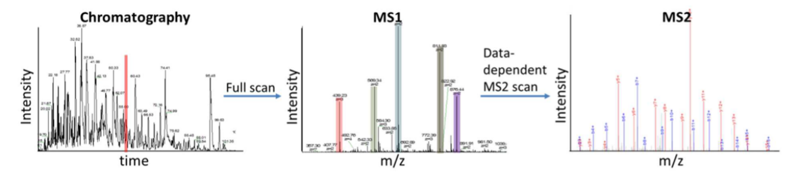

# Mass Spectrometry-Based Proteomics: A Tool to Investigate Cellular Signaling

---

## Experimental Workflow

- **Input:** Cell culture, tissue, or primary cells
- **Treatments:** Untreated vs drug- or cytokine-treated
- **Steps:** Trypsin digestion, phosphopeptide enrichment (TiO₂/DHB or Ti⁴⁺-IMAC), anti-phosphotyrosine enrichment  
  *Adapted from Macek et al.,* [*Annu. Rev. Pharmacol.
  Toxicol.* (2009)](https://doi.org/10.1146/annurev.pharmtox.011008.145606)

---

## Image Analysis Workflow

- Quantitative phenotypic signatures
- Massively parallel sequencing/proteomics
- Multi-scale network biology
- Deep learning-based forecasting
- Applications in signaling, precision medicine, disease biology

---

## Experimental Workflow: Data Acquisition

- **Chromatography → MS → MS²**
- Full-scan MS1 and fragmentation scan MS2
- Signal plotted by m/z and retention time

---

## Data Analysis: Quantification & Identification

- **MS1:** Quantification (intensity vs. retention time)
- **MS2:** Identification (fragmentation pattern vs. m/z)

---

## Label-Free LC-MS/MS

- Comparison of control vs. treated conditions
- Use of Extracted Ion Chromatograms (XIC)
- Relative quantification

---

## Sample Preparation for MS

- Protein precipitation, trypsin digestion
- IMAC microparticle enrichment
- Label-free peptide quantification
- LC-MS/MS analysis

### Labeling Strategies

- **MS1 Labeling:** Metabolic or chemical
- **MS2 Labeling:** Chemical tags
- Multiplexed intensity channels

---

## Orbitrap Fusion Mass Spectrometer Architecture

- Dual linear ion trap, HCD collision cell
- Orbitrap analyzer
- Ion optics: C-trap, multipoles, S-lens, quadrupole

---

## LC-MS Interface and Solvents

- HPLC coupled to MS
- Mobile phase solvents
- Chromatogram and mass spectrum output

---