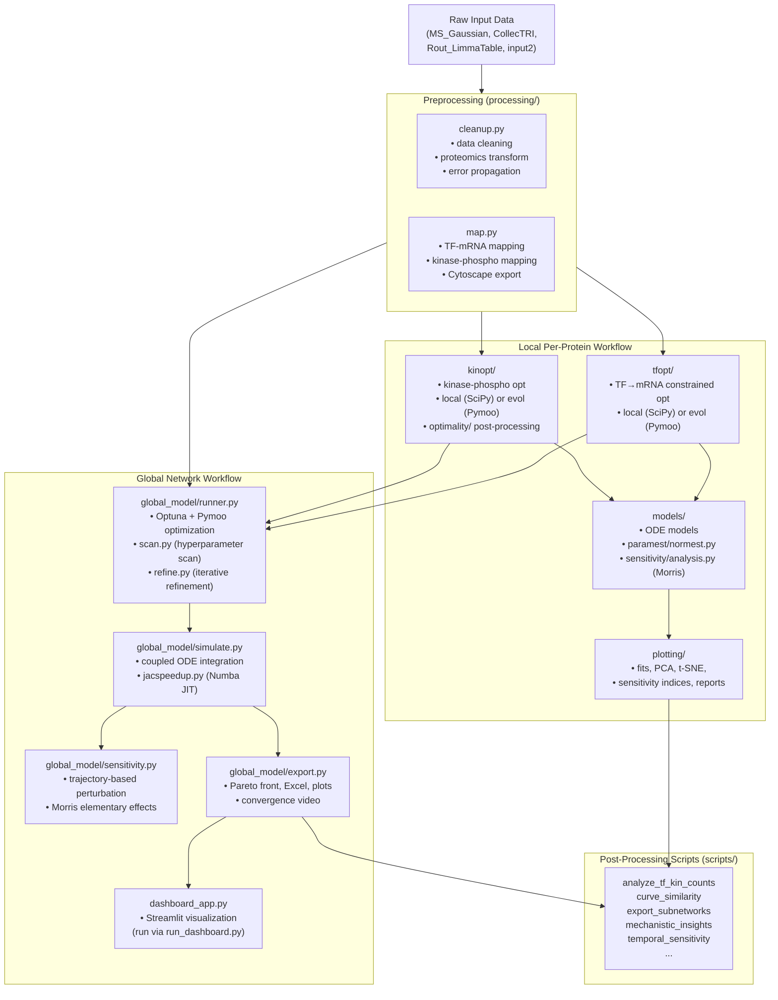

# Architecture and Data Flow

This page describes the high-level architecture of PhosKinTime and how data flows through the
pipeline from raw experimental inputs to final outputs.

---

## Two Modeling Stacks

PhosKinTime provides two complementary but distinct modeling workflows:

### Local (per-protein) workflow

Fits individual protein ODE models to per-site phosphoproteomics time series. Each protein/site
is handled independently. Optimization uses SciPy (local) or Pymoo evolutionary algorithms (evol).

Packages involved: `processing`, `kinopt`, `tfopt`, `models`, `paramest`, `sensitivity`, `steady`,
`plotting`.

### Global (network-scale) workflow

Solves a coupled ODE system spanning all genes, proteins, and kinases simultaneously. Calibrated
against multi-omics time series (protein, mRNA, phospho). Uses Optuna + Pymoo for hyperparameter
scanning and multi-objective evolutionary optimization.

Packages involved: `processing`, `global_model`, `frechet`, `knockout`.

---

## Data Flow Diagram



> **Note:** The `all` CLI command runs `prep → tfopt → kinopt → model` only. It does **not** invoke
> `global_model`. Run `phoskintime-global` (or `python -m global_model.runner`) separately after
> the local pipeline completes.

---

## Key Package Roles

| Package | Role |
|---|---|
| `processing/` | Raw data cleaning and network mapping |
| `tfopt/` | TF→mRNA optimization (local or evolutionary) |
| `kinopt/` | Kinase→phospho optimization (local or evolutionary) |
| `models/` | Per-protein ODE definitions and solvers |
| `paramest/` | Parameter estimation (`normest.py`); bootstrap confidence intervals |
| `sensitivity/` | Morris sensitivity analysis (local ODE models) |
| `steady/` | Steady-state initial condition computation |
| `plotting/` | Static publication-ready plots and HTML reports |
| `global_model/` | Network-scale coupled ODE simulation and calibration |
| `frechet/` | Discrete Fréchet distance metric (Numba JIT) |
| `knockout/` | Network knockout / perturbation analysis |
| `config/` | CLI, constants, logging, shared configuration helpers |
| `config_loader.py` | Root-level `config.toml` loader (LRU-cached) |
| `scripts/` | Stand-alone post-processing and analysis utilities |

---

## Local vs Global: When to Use Which

| Goal | Use |
|---|---|
| Fit individual protein phosphorylation dynamics | Local workflow (`kinopt` + `models`) |
| Fit TF → mRNA regulation | `tfopt` |
| System-level network simulation | `global_model` (requires kinopt/tfopt outputs) |
| Sensitivity of individual ODE parameters | `sensitivity/analysis.py` |
| Sensitivity of global coupled model parameters | `global_model/sensitivity.py` |
| Interactive exploration of results | `run_dashboard.py` (Streamlit) |

---

## Directory Structure Summary

```
phoskintime/
├── config/             CLI, constants, logging setup
├── config_loader.py    Shared config.toml loader
├── config.toml         Project configuration
├── processing/         Data preprocessing and mapping
├── tfopt/              TF optimization (local + evol)
├── kinopt/             Kinase optimization (local + evol)
├── models/             Per-protein ODE models
├── paramest/           Parameter estimation routines
├── sensitivity/        Morris sensitivity analysis
├── steady/             Steady-state solvers
├── plotting/           Visualization and reports
├── global_model/       Global coupled ODE pipeline
├── frechet/            Fréchet distance metric
├── knockout/           Knockout analysis
├── utils/              Shared helpers
├── bin/                CLI entry points
├── scripts/            Stand-alone analysis utilities
├── background/         Background tasks and helpers
├── app/                Web application assets
├── run_dashboard.py    Dashboard launcher
└── Dockerfile          Container definition
```

---

## Technical Debt Notes

- **Logging**: Five near-identical `logconf.py` files exist across `config/`, `kinopt/local/config/`,
  `kinopt/evol/config/`, `tfopt/local/config/`, and `tfopt/evol/config/`. They cannot be trivially
  consolidated because each imports `LOG_DIR` and `format_duration` from its own subpackage, and the
  top-level version adds a `mp_file_logging` parameter. Unification is tracked as a TODO in each file.
- **Configuration overlap**: `config_loader.py` and `global_model/config.py` both load sections of
  `config.toml`. The latter should eventually import from the former to avoid duplication.
- **`kinopt/` and `tfopt/` mirroring**: Both subpackages expose identical `local/` and `evol/`
  sub-interfaces. A shared strategy abstraction would reduce duplication but is deferred.
