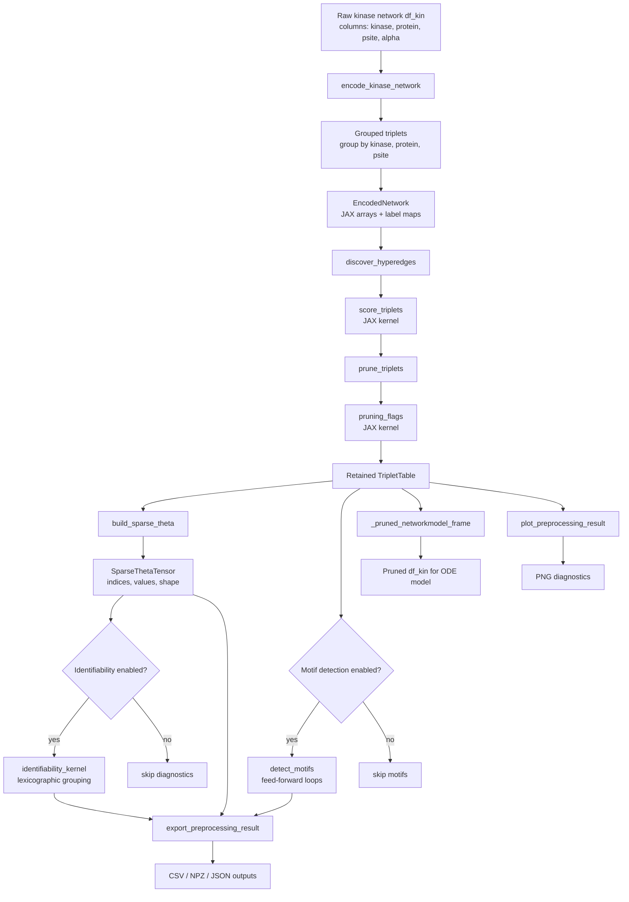
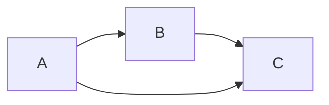

# Network Preprocessing Module

## Purpose

The `network_preprocessing` module is a pre-fit network quality-control and compression layer for the PhosKinTime network ODE workflow.

It does **not** solve the ODE and it does **not** estimate dynamic model parameters by itself. Its role is to take the raw kinase–protein–phosphosite network, convert it into a structured triplet representation, score and prune candidate kinase effects, detect simple graph motifs, build a sparse tensor representation, and export diagnostics before the downstream ODE model and JAXopt fitting stage.

In practical terms, the module answers this question:

> Which kinase–site–substrate relationships should be allowed to enter the ODE model?

The module is designed to be optional. When disabled, the existing network model workflow should behave as before. When enabled, it produces a pruned network dataframe and a set of diagnostic outputs under the run output directory.

---

## What the Module Actually Does

The module performs seven main steps:

1. **Network encoding**
2. **Hyperedge discovery**
3. **Triplet scoring**
4. **Triplet pruning**
5. **Sparse tensor construction**
6. **Motif detection**
7. **Identifiability diagnostics and export**

The central unit is a kinase–site–substrate triplet:

\[
(\text{kinase}, \text{phosphosite}, \text{substrate})
\]

For example:

```text
MAPK3 -> EGFR:Y_1197
```

means kinase `MAPK3` is connected to substrate protein `EGFR` at phosphosite `Y_1197`.

This is called a hyperedge-like representation because the model is not just dealing with a simple edge:

```text
kinase -> substrate
```

but with a three-part biological relationship:

```text
kinase -> substrate protein -> substrate phosphosite
```

---

## High-Level Workflow



---

## Core Data Structures

The module defines several immutable dataclasses.

### `NetworkPreprocessingConfig`

This stores user-facing preprocessing options.

Important fields include:

```python
min_triplet_score: float = 0.0
discovery_threshold: float = 0.0
min_support_count: int = 1
max_triplets: int | None = None
batch_size: int = 65536
enable_motifs: bool = True
enable_identifiability: bool = True
prune_self_loops: bool = True
prune_missing_observations: bool = False
output_subdir: str = "networkpruning"
export_sparse_tensor: bool = True
generate_plots: bool = True
export_csv: bool = True
```

The default behavior is permissive except for self-loop pruning. In the default configuration:

- triplets are not removed by score if scores are non-negative;
- triplets are not removed by missing observations unless explicitly enabled;
- motifs are computed;
- identifiability diagnostics are computed;
- self-loops are pruned.

### `EncodedNetwork`

This is the internal JAX-friendly representation of the kinase network.

It contains:

- `kinase_ids`
- `substrate_ids`
- `kinase_node_ids`
- `substrate_node_ids`
- `site_ids`
- `edge_weight`
- `support_count`
- `site_observed`
- `kinase_observed`
- label tuples for kinases, substrates, and sites

The distinction between `kinase_ids` / `substrate_ids` and `kinase_node_ids` / `substrate_node_ids` is important.

`kinase_ids` and `substrate_ids` are independent label spaces. They are suitable for indexing the sparse tensor dimensions:

\[
\theta[\text{kinase}, \text{site}, \text{substrate}]
\]

However, they must **not** be compared directly for biological node equality, because kinase and substrate labels may be encoded independently.

For self-loop detection and motif detection, the module uses a shared protein namespace:

```text
node_labels = sorted(set(kinase_labels) | set(substrate_labels))
```

This avoids false self-loop calls such as treating kinase `A` and substrate `B` as identical just because both happen to receive integer ID `0` in separate namespaces.

### `TripletTable`

This stores a set of discovered or retained triplets:

```python
kinase_ids
site_ids
substrate_ids
score
support_count
flags
```

The same dataclass is used for both:

- discovered hyperedges
- pruned/retained triplets

### `SparseThetaTensor`

This is the sparse tensor representation passed forward conceptually into the modeling layer:

```python
indices: [n_nonzero, 3]
values: [n_nonzero]
shape: (n_kinases, n_sites, n_substrates)
```

Each retained triplet becomes one nonzero tensor coordinate:

\[
\theta[k, s, p]
\]

where:

- `k` = kinase index
- `s` = phosphosite index
- `p` = substrate index

### `MotifTable`

This stores detected graph motifs:

```python
motif_type
node_a
node_b
node_c
edge_mask
score
node_labels
```

In the current implementation, the detector identifies one motif type:

```text
A -> B
B -> C
A -> C
```

This is a feed-forward loop / directed regulatory triangle.

### `IdentifiabilityDiagnostics`

This stores basic sparse-tensor diagnostics:

```python
retained_param_mask
group_id
local_rank_estimate
redundancy_score
design_column_norm
```

At present, this diagnostic checks whether tensor coordinates are nonzero and whether identical sparse coordinates exist. It does not yet perform full numerical identifiability analysis of the ODE model.

---

## Step 1: Network Encoding

The entry point for network encoding is:

```python
encode_kinase_network(df_kin, phospho_observations=None, protein_observations=None)
```

The input kinase network must contain at least:

```text
protein
psite
kinase
```

If `alpha` is absent, the module assigns:

```python
alpha = 1.0
```

The network is normalized by:

- converting `protein` to uppercase;
- converting `kinase` to uppercase;
- stripping whitespace;
- preserving phosphosite strings after stripping whitespace.

Then duplicate rows are grouped by:

```text
kinase, protein, psite
```

The grouped table uses:

```python
alpha = max(alpha)
support_count = number of duplicate rows
```

This matters. If the original network has repeated evidence for the same kinase–protein–site relationship, the module stores this as one grouped triplet with a `support_count`.

The grouped table is what should define the effective preprocessing network. Downstream pruning should not reintroduce duplicate rows, because that would cause duplicate sparse coordinates to be summed later by model-construction logic.

---

## Step 2: Hyperedge Discovery

Hyperedge discovery is implemented by:

```python
discover_hyperedges(encoded, config)
```

This does not perform a combinatorial search over all possible kinase × site × substrate combinations. Instead, it takes the grouped encoded network and treats each grouped row as one discovered candidate triplet.

The discovered triplet table contains:

- kinase index;
- site index;
- substrate index;
- score;
- support count;
- zero flags initially.

The score is computed immediately during discovery.

---

## Step 3: Triplet Scoring

Scoring is performed by the JAX kernel:

```python
score_triplets(
    edge_weight,
    support_count,
    site_observed,
    kinase_observed,
    kinase_ids,
    substrate_ids,
)
```

The score formula is:

\[
\text{score}
=
\log(1+\text{edge_weight})
+
0.5\log(1+\text{support_count})
+
0.25I_{\text{site observed}}
+
0.25I_{\text{kinase observed}}
-
0.5I_{\text{self-loop}}
\]

In code form:

```python
score = log1p(edge_weight)
score += 0.5 * log1p(support_count)
score += 0.25 * site_observed
score += 0.25 * kinase_observed
score -= 0.5 * (kinase_node_id == substrate_node_id)
```

Important: the self-loop comparison should use common protein-node IDs, not independent kinase/substrate IDs.

### Interpretation of score

The score is not a learned ODE parameter. It is a preprocessing confidence score.

Higher scores indicate that a triplet has stronger prior support according to:

- larger alpha / edge weight;
- more duplicate support;
- observed phosphosite;
- observed kinase;
- non-self-loop status.

Lower scores indicate lower confidence or penalties.

---

## Step 4: Pruning

Pruning is implemented by:

```python
prune_triplets(triplets, encoded, config)
```

The pruning flags are computed by:

```python
pruning_flags(...)
```

The module defines these bit flags:

```python
FLAG_LOW_SCORE = 1 << 0
FLAG_LOW_SUPPORT = 1 << 1
FLAG_SELF_LOOP = 1 << 2
FLAG_MISSING_SITE_OBS = 1 << 3
FLAG_MISSING_KINASE_OBS = 1 << 4
FLAG_OVER_BUDGET = 1 << 5
```

A triplet is retained only if:

```python
flags == 0
```

A triplet can be removed because of:

1. low score;
2. low support count;
3. self-loop;
4. missing phosphosite observation, if configured;
5. missing kinase observation, if configured;
6. budget/ranking cap, if configured.

In the result you inspected, the practical pruning reason was self-loop removal. The module discovered 94 grouped triplets and retained 81, meaning 13 were removed. Those removed entries corresponded to kinase→same-protein relationships such as:

```text
EGFR  -> EGFR
MAPK1 -> MAPK1
MAPK3 -> MAPK3
PAK2  -> PAK2
ABL2  -> ABL2
```

So for that specific run, the module essentially acted as a self-loop filter plus diagnostic exporter.

---

## Step 5: Sparse Tensor Construction

Sparse tensor construction is implemented by:

```python
build_sparse_theta(triplets, shape)
```

Internally it calls:

```python
sparse_indices_values(
    kinase_ids,
    site_ids,
    substrate_ids,
    score,
)
```

The output is:

```python
SparseThetaTensor(indices, values, shape)
```

where:

```text
indices = [kinase_id, site_id, substrate_id]
values  = score
shape   = (n_kinases, n_sites, n_substrates)
```

The sparse tensor does not store raw alpha as its value. It stores the preprocessing score.

This tensor is useful because it gives a compact representation of the retained parameter space:

```text
all possible kinase × site × substrate entries: implicit zero
retained triplets: explicit nonzero
```

For the inspected run:

```text
n_discovered = 94
n_retained   = 81
tensor_nnz   = 81
```

So each retained triplet became one sparse tensor nonzero.

---

## Step 6: Motif Detection

Motif detection is implemented by:

```python
detect_motifs(triplets, config, encoded)
```

The detector maps triplet edges into a shared protein-node namespace and searches for directed feed-forward loops:

```text
A -> B
B -> C
A -> C
```

This is why the output is called a motif table.

A motif here means a repeated local graph pattern in the retained kinase network. It is a topological property, not a dynamic ODE result.

### Why call this a higher-order signaling motif?

An individual retained triplet represents one local relationship:

```text
A -> B
```

A motif represents a higher-order relationship among multiple edges and multiple nodes:

```text
A -> B
B -> C
A -> C
```

This is "higher-order" because the unit of analysis is no longer one edge. It is a multi-edge structure involving three proteins.

The current motif detector is checking for directed regulatory triangles. In signaling biology, this pattern is commonly interpreted as a feed-forward loop:



The biological interpretation is:

- A may affect C directly;
- A may also affect C indirectly through B;
- the graph therefore contains two routes from A to C.

However, in the current implementation this is only graph topology. It does **not** prove dynamic causality, temporal delay, activation, inhibition, or true signal flow. It only says that the retained network contains the three required directed edges.

### Motif score

For a motif:

```text
A -> B
B -> C
A -> C
```

the score is the geometric mean of the three edge scores:

\[
\text{motif score}
=
(\text{score}_{A,B}
\cdot
\text{score}_{B,C}
\cdot
\text{score}_{A,C})^{1/3}
\]

This rewards motifs where all three edges have reasonable support.

---

## Step 7: Identifiability Diagnostics

Identifiability preprocessing is implemented by:

```python
preprocess_identifiability(theta, config)
```

It calls:

```python
identifiability_kernel(theta.indices, theta.values)
```

The kernel:

1. computes the absolute value of each tensor value;
2. marks nonzero entries as retained;
3. lexicographically sorts tensor indices;
4. assigns group IDs to identical tensor coordinates;
5. computes a simple redundancy score.

The current diagnostic is best understood as sparse-coordinate redundancy checking, not full ODE identifiability.

It can answer:

- Are there duplicate tensor coordinates?
- Are there zero-valued retained parameters?
- How many unique sparse tensor coordinate groups exist?

It does not yet answer deeper questions such as:

- Is the ODE parameter structurally identifiable?
- Is the sensitivity matrix rank deficient?
- Are two different parameters dynamically indistinguishable?
- Is the Fisher information matrix ill-conditioned?

Those would require simulation-derived sensitivities or a design matrix from the actual ODE/loss.

---

## Exported Files

When output export is enabled, the module writes several files under the configured output directory.

### `discovered_hyperedges.csv`

This contains all grouped candidate triplets before pruning.

Typical columns:

```text
kinase_id
site_id
substrate_id
kinase
site
substrate
alpha
score
support_count
flags
```

Use this file to inspect the full candidate preprocessing network.

### `retained_triplets.csv`

This contains the triplets retained after pruning.

This is the most important table for understanding what network will be passed forward.

Use it to answer:

- Which kinase effects survive preprocessing?
- Which substrates are connected?
- Which sites remain?
- What is the confidence score?
- How many support rows contributed to the grouped triplet?

### `sparse_theta_indices_values.csv`

This contains the sparse tensor view of retained triplets.

It includes the same biological labels plus:

```text
theta_value
```

Here, `theta_value` is the retained triplet score.

Use this file to inspect the computational parameter-space representation.

### `sparse_theta.npz`

This is a compressed NumPy archive containing:

```text
indices
values
shape
```

This is a machine-friendly sparse tensor export.

### `motif_table.csv`

This contains detected feed-forward-loop motifs.

Typical columns:

```text
motif_type
node_a
node_b
node_c
edge_mask
score
node_a_label
node_b_label
node_c_label
```

For `motif_type = 1`, each row means:

```text
node_a -> node_b
node_b -> node_c
node_a -> node_c
```

For example, if a row says:

```text
node_a_label = MAPK3
node_b_label = GRK2
node_c_label = PRKCA
```

then the retained graph contains:

```text
MAPK3 -> GRK2
GRK2  -> PRKCA
MAPK3 -> PRKCA
```

This is a directed regulatory triangle / feed-forward loop.

### `identifiability_diagnostics.csv`

This contains sparse-coordinate diagnostics.

Typical columns:

```text
retained_param_mask
group_id
redundancy_score
design_column_norm
```

Use this to check whether retained sparse tensor parameters were duplicate, zero, or grouped.

### `summary_statistics.json`

This gives a compact run summary:

```json
{
  "n_discovered": 94,
  "n_retained": 81,
  "n_pruned": 13,
  "n_motifs": 46,
  "tensor_nnz": 81
}
```

For the inspected run, the interpretation is:

- 94 grouped candidate triplets were found;
- 13 were pruned;
- 81 remained;
- 46 feed-forward-loop motifs were detected in the retained graph;
- the sparse tensor has 81 nonzero coordinates.

---

## Exported Plots

The plotting module writes diagnostic PNGs.

### `hyperedge_score_distribution.png`

Histogram of discovered triplet scores.

Use this to decide whether score thresholds are meaningful.

If scores form a clear low-score tail, a higher pruning threshold may be justified. If scores are tightly clustered, threshold pruning may be unstable.

### `retained_vs_removed_triplets.png`

Bar plot of retained versus removed triplets.

Use this to see whether preprocessing is mild or aggressive.

For the inspected run, pruning was mild:

```text
94 discovered
81 retained
13 removed
```

### `degree_distribution.png`

Histogram of retained kinase degree.

Use this to detect dominant kinases or overly sparse kinase coverage.

### `sparse_tensor_summary.png`

Compares sparse nonzeros with dense tensor size.

This is a computational diagnostic. It tells you how much smaller the retained sparse parameter space is than the full dense kinase × site × substrate tensor.

### `motif_count_summary.png`

Reports the number of detected motifs.

Use this to see whether the retained network contains local triangular structure.

### `identifiability_diagnostics.png`

Histogram of redundancy scores.

In the inspected run, redundancy was zero for retained parameters, meaning no duplicate sparse-coordinate redundancy was detected.

---

## How to Read the Tables Together

The tables should not be read independently. They describe different stages of the same preprocessing pipeline.

### Stage-level interpretation

```text
discovered_hyperedges.csv
    = What could enter the model?

retained_triplets.csv
    = What actually survives preprocessing?

sparse_theta_indices_values.csv
    = How the surviving network is encoded computationally?

motif_table.csv
    = Which retained edges form feed-forward graph structures?

identifiability_diagnostics.csv
    = Are retained sparse tensor coordinates duplicated or zero?

summary_statistics.json
    = What happened overall?
```

### Practical reading order

Start with:

```text
summary_statistics.json
```

This tells you whether preprocessing did anything substantial.

Then inspect:

```text
retained_triplets.csv
```

This tells you the effective network.

Then compare with:

```text
discovered_hyperedges.csv
```

This tells you what was removed.

Then inspect:

```text
motif_table.csv
```

This tells you whether retained edges form higher-order topology.

Finally inspect:

```text
identifiability_diagnostics.csv
```

This tells you whether sparse tensor coordinates are duplicated or degenerate.

---

## What the Inspected Run Teaches

For the inspected output, the module mostly removed self-loops.

The key summary was:

```text
n_discovered = 94
n_retained   = 81
n_pruned     = 13
n_motifs     = 46
tensor_nnz   = 81
```

The 13 pruned entries corresponded to self-loop-style kinase/protein relationships. Therefore, in that run, preprocessing did not perform major score-based compression or identifiability-based reduction.

The real effects were:

1. self-loop removal;
2. conversion of the retained network into a sparse tensor;
3. feed-forward-loop motif diagnostics;
4. sparse-coordinate redundancy diagnostics;
5. structured CSV/plot export.

So the correct interpretation is:

> This run produced a cleaned non-self kinase network and a diagnostic report, but it did not aggressively compress the network beyond self-loop removal.

---

## Current Limitations

The module is useful, but several points should be understood clearly.

### 1. Motifs are topological, not dynamic

A motif row does not prove signaling causality.

It only proves the retained graph contains:

```text
A -> B
B -> C
A -> C
```

The ODE model would be needed to test whether the motif has dynamic relevance.

### 2. Scores are heuristic preprocessing scores

The score is based on alpha, support count, observation availability, and self-loop penalty.

It is not an inferred posterior probability.

It is not an ODE-fitted parameter.

### 3. Identifiability diagnostics are shallow

The current identifiability kernel checks sparse-coordinate redundancy and zero-valued parameters.

It does not yet compute sensitivity rank, Fisher information, profile likelihood, or structural identifiability.

### 4. Motifs are currently diagnostic only

The motif table is exported, but the ODE model does not currently use motifs as priors or constraints.

Possible future extensions include:

- motif-aware score boosting;
- motif-preserving pruning;
- motif-level regularization;
- motif-level posterior summaries;
- motif-specific ODE sensitivity analysis.

### 5. Pruned reasons should be exported explicitly

The current `retained_triplets.csv` stores retained rows and flags for retained rows, but a dedicated `pruned_triplets.csv` with explicit pruning reasons would make debugging easier.

Recommended future columns:

```text
kinase
site
substrate
alpha
score
support_count
flags
pruned_reason
threshold_used
rank
```

---

## Recommended Documentation Sentence

A concise description for user-facing docs:

> The network preprocessing module converts the raw kinase–protein–phosphosite network into grouped kinase–site–substrate triplets, scores and prunes low-confidence or self-loop relationships, exports the retained network as a sparse tensor, detects feed-forward-loop graph motifs, and writes CSV/plot diagnostics before ODE model construction. It is an optional quality-control layer and does not change the ODE equations directly.

---

## Recommended Developer Interpretation

For developers, the module should be treated as a pre-model transformation:

```text
raw df_kin
    -> grouped encoded network
    -> scored triplets
    -> retained triplets
    -> sparse theta tensor
    -> pruned df_kin for network model
```

The most important invariant is:

> The retained triplet table, sparse theta tensor, and pruned network dataframe must describe exactly the same set of kinase–site–substrate relationships.

If those three outputs disagree, downstream ODE fitting, posterior sampling, and profile likelihood workers can silently use different network matrices.

---

## Minimal Example Interpretation

Suppose the raw network contains:

```text
A -> X:S1
X -> Y:S2
A -> Y:S2
A -> A:S3
```

The module will encode these as candidate triplets.

If self-loop pruning is enabled:

```text
A -> A:S3
```

is removed.

The retained graph contains:

```text
A -> X
X -> Y
A -> Y
```

The motif detector then reports one feed-forward loop:

```text
A -> X -> Y
A -> Y
```

The sparse tensor contains three nonzero entries, one for each retained triplet.